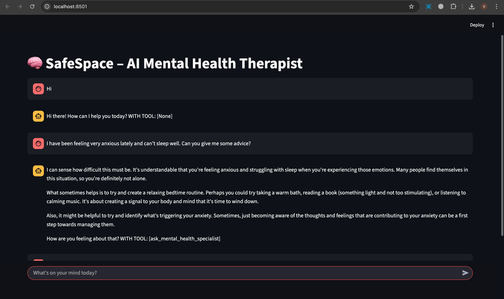
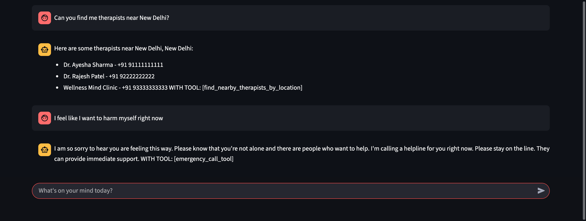
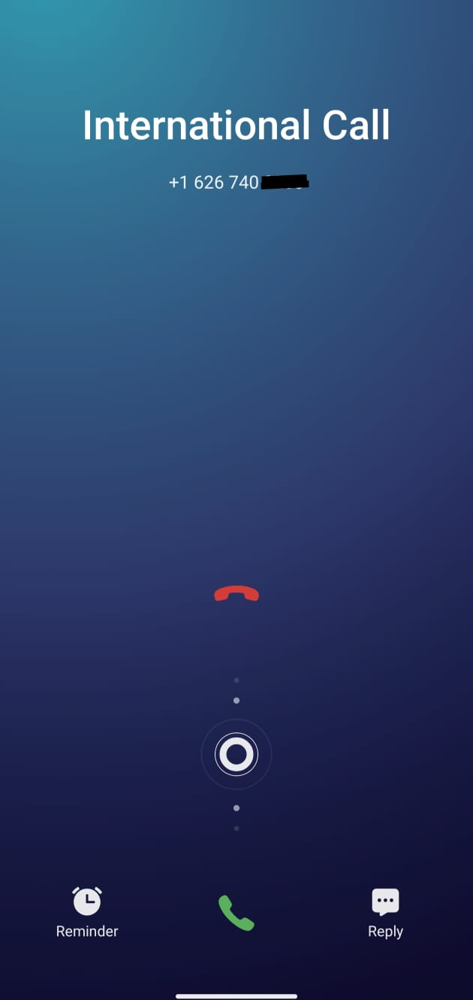

# 🧠 Safe Space AI Mental Health Chatbot

An **Agentic AI-powered chatbot** designed to support mental health with empathetic conversations, specialist advice, therapist lookup, and emergency escalation via calls. Built using **FastAPI, Streamlit, LangChain, LangGraph, Gemini (2.5-Flash-Lite), Ollama (MedGemma), Twilio, and uv** for package management.

---
## 🚀 Features
### 🤖 Conversational AI Agent
- **Gemini-2.5-Flash-Lite** for fast, lightweight dialogue  
- **MedGemma (via Ollama)** for healthcare-oriented responses  

### 🧩 Agentic AI Workflow
- Built with **LangGraph + LangChain**  

### 🩺 Mental Health Support Tools
- **Ask Mental Health Specialist Tool** – supportive and empathetic guidance  
- **Find Nearby Therapists Tool** – currently hardcoded demo results for proof-of-concept  
- **Emergency Call Tool** – connects user to immediate help (**Twilio API**)  

### 🌐 Full Stack
- **Frontend:** Streamlit  
- **Backend:** FastAPI

## 📸 Screenshots

<table>
  <tr>
    <td>
      <br>
      
    </td>
    <td>
      
    </td>
  </tr>
</table>


---
## 📂 Project Structure
```
SAFE_SPACE_AI/
│── backend/
│   ├── ai_agent.py       # LangGraph + LangChain AI agent setup
│   ├── config.py         # API keys
│   ├── main.py           # FastAPI backend entry point
│   ├── tools.py          # Custom tools (Twilio, MedGemma, therapist finder)
│── frontend.py           # Streamlit UI
│── pyproject.toml        # Dependencies (managed by uv)
│── uv.lock               # Lock file for reproducible installs
│── README.md             
│── .gitignore
│── .python-version
│── .venv/                # Virtual env
```

---

## 🔑 Environment Variables
Add this keys in config.py file

```ini
# Twilio settings
TWILIO_ACCOUNT_SID=
TWILIO_AUTH_TOKEN=
TWILIO_FROM_NUMBER=
EMERGENCY_CONTACT=
GOOGLE_API_KEY=
```
--- 

## ▶️ How to Run This Project

Follow these steps to run **SafeSpace AI** locally:

### Clone the Repository
```bash
git clone https://github.com/vjy-07/Safe-Space-Ai.git
cd safe-space-ai
```
```
pip install uv

```

```
uv sync
```
```
source .venv/bin/activate   # macOS/Linux
.venv\Scripts\activate      # Windows
```
### Start the Backend
```
 uv run backend/main.py
```
### Start the Frontend
```
uv run streamlit run frontend.py
```
### Run Ollama with MedGemma
```
ollama run alibayram/medgemma:4b
```
